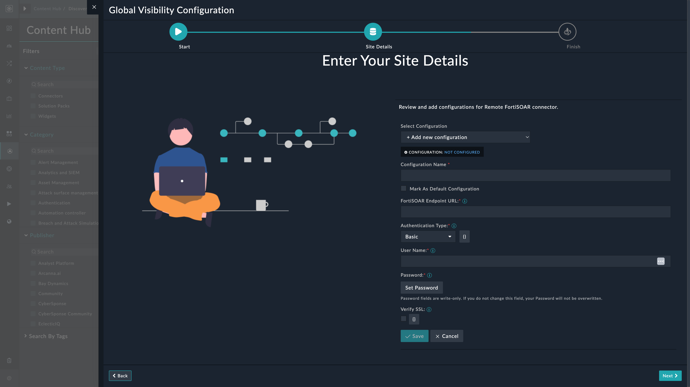
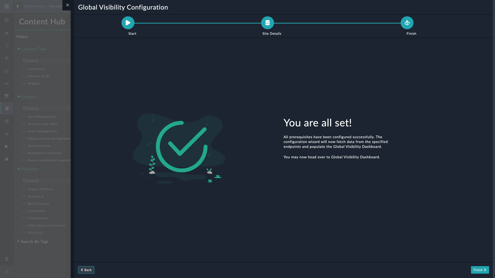

[Home](../README.md) |
|--------------------------------------------|

# Installation

1. To install a solution pack, click **Content Hub** > **Discover**.
2. From the list of solution pack that appears, search for and select **Global Visibility**.
3. Click the **Global Visibility** solution pack card.
4. Click **Install** on the lower part of the screen to begin the installation.

## Prerequisites
The **Global Visibility** solution pack depends on the following solution packs that are installed automatically &ndash; if not already installed.

| Solution Pack Name | Version         | Purpose                                       |
|:-------------------|:----------------|:----------------------------------------------|
| SOAR Framework     | v2.0.1 or later | Required for Alerts, Assets, Incident modules |
| SOC Simulator      | v1.0.2 or later | Required for record simulation                |

Before installing the FortiSOAR Global Visibility Solution Pack, ensure the following prerequisites are met:

1. A working FortiSOAR instance at each site
2. Access to the FortiSOAR API of each instance
3. User credentials with appropriate permissions to access data using API
4. Remote FortiSOAR connector for Global Visibility data aggregation

# Configuration

## Install and Configure Connectors
For optimal performance of the **Global Visibility** solution pack, install and configure the following connectors:

- **Remote FortiSOAR** - This connector facilitates automated interactions, with a FortiSOAR endpoint using FortiSOAR™ APIs. To configure and use the Remote FortiSOAR connector, refer to [Configuring Remote FortiSOAR](https://docs.fortinet.com/fortisoar/connectors/remotefsr)

## Setup Global Visibility on FortiSOAR
After installation of the **Global Visibility** solution pack, run the configuration wizard to ready your FortiSOAR environments to reterive information from them. This wizard helps you to configure other FortiSOAR sites.

1. Log in to FortiSOAR, after [installation](#installation) completes.

2. Click the button **Configure** from the lower-left of the screen.

    

3. Click the button **Let's get started** on the Outbreak Response Framework configuration page.

    

4. Configure Remote FortiSOAR connector. Add multiple connector configurations to retreive information from multiple sites and click **Next**.

    

5. Click **Finish** to complete the configuration process.
   
    

# Next Steps
| [Usage](./usage.md) | [Contents](./contents.md) |
|---------------------|---------------------------|
